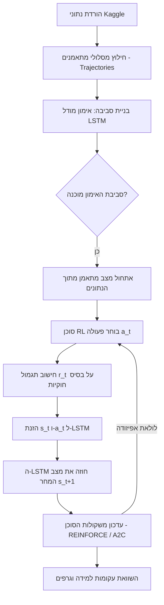

# חלק A: ניסוח הבעיה (Problem Formulation)

## 1. המלצת אימונים כבעיית החלטה סדרתית (MDP)
המלצת אימונים אינה בעיית סיווג או רגרסיה רגילה, אלא בעיה של **החלטה סדרתית** (Sequential Decision Making). מצב המתאמן ביום מסוים תלוי באופן ישיר בהיסטוריית האימונים, בתשישות המצטברת ובמאזן השרירים מימים קודמים.
בחירת אימון היום משפיעה לא רק על הרווח המיידי, אלא על היכולת להתאמן מחר ועל הסיכון לפציעה או עומס יתר. לכן, הדרך הטבעית למדל זאת היא באמצעות תהליך החלטה מרקובי (MDP) הנפתר בעזרת סוכני Reinforcement Learning הממקסמים תגמול ארוך טווח.

## 2. הגדרת רכיבי ה-MDP (עד לקוצו של יוד)

- **מצב ($s_t$)**: ייצוג קומפקטי של מצב המתאמן ביום ה-$t$. המצב כולל את:
  - העומס המתגלגל בימים האחרונים (נפח האימון הכולל).
  - מאזן עומס בין קבוצות שרירים.
  - היום במחזור האימון (יום בשבוע או בתוכנית).
  - *היסטוריה*: מכיוון שהמצב אינו מוגדר רק על ידי היום הנוכחי (POMDP), אנו משתמשים ברשת LSTM שלוכדת את המצב החבוי ($h_t$) על בסיס רצף העבר.

- **פעולה ($a_t$)**: סוג האימון שהוקצה למתאמן בזמן $t$.
  - הפעולה היא בדידה, כאשר חילצנו כ-6 אשכולות (Clusters) של סוגי אימונים מתוך נתוני Kaggle (למשל: אימון עצימות גבוהה, אימון פלג גוף עליון, יום מנוחה).

- **תגמול ($r_t$)**: ערך משוב סקלרי עבור הפעולה $a_t$.
  - התגמול מחושב כפונקציה שמעודדת בניית כושר וקונסת על תכנון לקוי:
    $r_t = gain_t - \lambda_1 \cdot overload\_penalty_t - \lambda_2 \cdot imbalance\_penalty_t$

- **מעבר ($P(s_{t+1} | s_t, a_t)$)**: פונקציית המעבר בין המצבים (הסימולטור).
  - בעולם האמיתי המעבר הפיזיולוגי אינו ידוע. בפרויקט זה, רשת ה-LSTM שאימנו לומדת לקרב פונקציה זו ($st+1 \approx f_\phi(s_t, a_t, h_t)$) ומשמשת כסביבת האימון עבור הסוכנים.

## 3. תרשים זרימת צינור הלמידה (Pipeline Flowchart)

